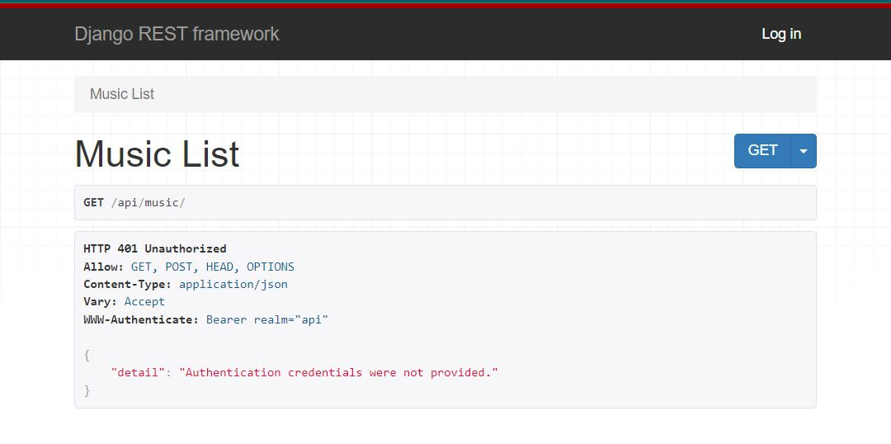
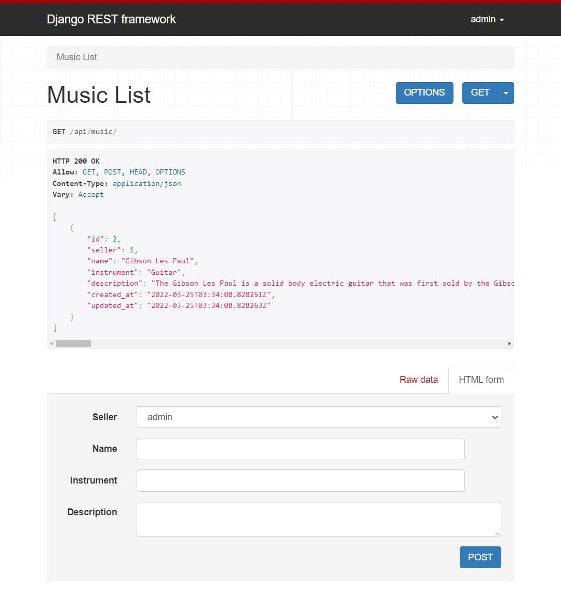

# Lab: 33 - Authentication & Production Server

**Authors**: Ediberto Ponce
**Version**: 1.0.0  
**PR**: https://github.com/ponceedi000/drf-auth/pull/1

## Overview
**Let’s move our API closer to production grade by adding Authentication and switching to a Production Server**

## Features (Django)
- Add JWT Authentication to your API.
  * Install needed libraries in project configuration and/or site settings.
- Keep any pre-existing authentication so DRF Browsable API still usable.
  * Install needed libraries in project configuration and/or site settings.

## Features (Django)
- Create a boilerplate `Dockerfile` and `docker-compose.yml` so you don’t need to start from scratch each time.
  * E.g. as a VS Code snippet, or a gist.
- Switch to using Gunicorn instead of Django’s built in development server.
  * mind the number of workers to avoid sluggishness
- Warning You will run into styling issues when you switch over to Gunicorn.
  * On Django side you’ll need to properly handle static files using Whitenoise
- Adjust docker-compose.yml so that data is persisted in a volume outside of container.

## Architecture
- Python
- Django
- Docker
- get_user_model
- superuser
- CRUD
- REST
- permissions
- PostgreSQL
- JWT
- whitenoise
- Gunicorn

### Name of feature: Create a web app utilizing Django REST Framework / Docker / Authentication & Production Server (Build from scratch)

- Estimate of time needed to complete: 3hrs

- Start time: 6:30pm 03/23

- Finish time: 8:30pm 03/24

- Actual time needed to complete: 5 hrs

## Resources
- [docker](https://docs.docker.com/compose/reference/build/)
- [Django SQLite to PostgreSQL database migration](https://medium.com/djangotube/django-sqlite-to-postgresql-database-migration-e3c1f76711e1)

## Proof of JWT
- While NOT logged in
  * 

- While logged in (data now visible)
  * 